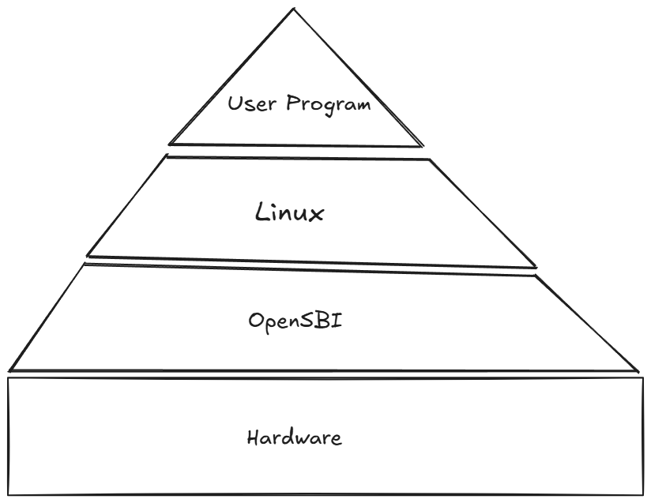

# 运行 Linux 操作系统

本文将使用 Bergamot 运行 Linux 操作系统.

## 准备

### 熟悉 Bergamot

在阅读本文之前，强烈推荐您通过 [运行 C 语言程序](docs/example/run-c-program.md) 来熟悉基本的 Bergamot 架构和仿真原理.


:::tip 仿真提示
对于本实例, 运行仿真时间较长, 具体取决于主机性能. 为了屏蔽不必要的输出, 请将 `bergamot/core/retire/InstructionRetire.scala` 中的所有 `printf` 语句注释掉.
:::

## 构建 OpenSBI

观察 RISC-V 的指令集, 我们可以发现, RISC-V 官方没有对任何硬件和物理环境做出假设, 一切的硬件操作均靠实现厂商来实现. 但是如果我们不想关心硬件驱动, 就可以调用基本的硬件操作, 例如通过 C 语言编写用户代码可通过 `printf` 函数直接在命令行打印字符串, 该怎么办?

RISC-V 官方制定了 S 模式二进制接口(SBI), 其中定义了多种常见的, 最基本的硬件操作函数, SBI 服务程序运行在 **M 模式** 下, 因此可以直接访问硬件, 可以为 **S 模式** 下的程序(一般是操作系统)提供最基本的硬件使用能力, 而无需关系硬件的底层实现.

例如, SBI 定义了 `sbi_printf` 函数, S 模式下的操作系统可以直接调用此函数, 实现在控制台打印字符. 当然 SBI 的服务依然需要厂商自己来实现.

RISC-V 官方提供了 SBI 的模板实现, 称为 OpenSBI, 其中提供了几种硬件驱动, 可供CPU厂商提供实现的参照模板, RISC-V 官方推荐CPU厂商实现 SBI 服务.

为了运行 Linux 操作系统, Bergamot 提供了两个基本硬件:

- 符合 CLINT 规范的定时器, 用于操作系统的进程调度
- UART8250 虚拟串口, 用于打印字符串到控制台, 以及用户输入.

幸运的是, OpenSBI 已经为我们提供了这两个外设的驱动, 因此我们无需编写驱动程序.

除此之外, OpenSBI 最重要的作用是提供启动引导(Boot Loader), OpenSBI 在启动之后, 将执行权交给 Linux, 然后正式启动 Linux. 当然其他启动引导, 例如 U-Boot 也可以完成.



拉取 OpenSBI 源代码:

```bash
git clone https://github.com/riscv-software-src/opensbi
cd opensbi
```

设置交叉编译器:

```bash
# 将 riscv64-linux-gnu- 修改为本地编译器路径
export CROSS_COMPILE=riscv64-linux-gnu-
export PLATFORM_RISCV_XLEN=32
```

最后编译 `generic` 平台下的固件:

```bash
make PLATFORM=generic
```

最后, 生成的固件在 `build/platform/generic/firmware/` 下面.

## 测试 OpenSBI

拷贝 `fw_payload.bin` 到 `simulator` 目录下面, `fw_payload.bin` 是 OpenSBI 的无格式二进制固件.

:::tip OpenSBI 固件
OpenSBI 提供了三种固件:

1. payload: 直接将待引导的程序拼接在 `fw_payload.bin` 后面, OpenSBI 启动后将直接引导该程序.
2. jump: OpenSBI 启动后跳转到指定的程序入口, 开始执行下一阶段的程序.
3. dynamic: OpenSBI 启动后从上一个启动阶段获取引导信息, 然后引导下一阶段的程序.

在本实例中, 我们使用 `payload` 固件, 将 Linux 镜像直接附加在 `fw_payload.bin` 后面, 因为现在还未编译 Linux 因此 `fw_payload.bin` 是一个空引导.

具体使用可参考 OpenSBI 目录下的 `docs` 文档.
:::

拷贝 `VerilatorTestCore.sv` 到 `simulator` 目录下.

目前, 启动 OpenSBI 基本的准备工作已经结束, 最后一个问题是 OpenSBI 如何识别我们的硬件? Linux 为了增加硬件驱动的可移植性, 引入了设备树的概念, [设备树](https://www.devicetree.org/) 是一种数据结构, 描述了当前硬件平台下所有的硬件信息, Linux 根据设备树来配置驱动程序. 相同的 OpenSBI 也同样使用设备树来识别硬件.

我们已经为您编写好了设备树文件 `simulator\sim_dt.dts` , 您可以查看里面描述的硬件内容. 设备树需要编译为特定的二进制数据结构, 需要使用 `dtc` 命令来编译设备树.

执行 `make` 将编译 Verilator 以及设备树.

最后, 我们仍然需要一个 `boot.bin` 来引导 OpenSBI, 因为 OpenSBI 的 payload 固件规定:

1. `a0` 寄存器放入 Hard ID.
2. `a1` 寄存器放入设备树所在的内存地址.

具体代码请查看 `boot.S` 文件, 通过编译得到下面的指令码:

```txt
80000637
f1402573
8ff005b7
000600e7
00000000
00000000
00000000
00000000
```

将上述内容以 **文本** 的形式直接保存在 simulator 文件夹下的 boot.hex 文件即可.

最后执行仿真命令:

```bash
./obj_dir/VVerilatorTestCore +Bfw_payload.bin +Dsim_dt.dtb
```

终端默认将每隔 1000000 个周期报告一次, 若成功进入 OpenSBI 将在终端打印 OpenSBI 的 Banner. 稍微等待一会, OpenSBI 将打印启动参数报告. 到这里, OpenSBI 即可正常启动.

## 拉取 Linux 源码并编译

拉取 Linux 源码仓库:

```bash
git clone https://github.com/torvalds/linux
cd linux
```

设置内核编译选项:

```bash
# 将 riscv64-linux- 修改为本地编译器路径
make ARCH=riscv CROSS_COMPILE=riscv64-linux- menuconfig
```

建议将其剪裁到最小内核, 可以大大降低启动时间, 但是要保证 `Platform type>Base ISA=RV32I` 以及 `Platform type>FPU Support=False` (不使用FPU).

最后编译构建内核:

```bash
# 将 riscv64-linux- 修改为本地编译器路径
make ARCH=riscv CROSS_COMPILE=riscv64-linux- Image
```

最后将得到非压缩无格式内核镜像 `arch/riscv/boot/Image` .

## 制作 Payload 启动镜像

将上一步得到的 `Image` 文件复制到 OpenSBI 的根目录下面. 并使用下面的命令重新编译 OpenSBI:

```bash
make PLATFORM=generic FW_PAYLOAD_PATH=Image
```

这样, 编译产物 `fw_payload.bin` 将附加上 Linux 镜像.

将得到的固件再次拷贝进 `simulator` , 并运行仿真程序.

在 OpenSBI 打印完启动参数报告之后, 就会将执行权交给 Linux 执行, Linux 将会在终端打印内核日志.

## 制作 BusyBox 根文件系统

在上一步中, 由于 Linux 找不到合适的根文件系统以及 `init` 程序, Linux 将 panic 并停止运行. 此步骤将使用 BusyBox 制作根文件系统.

[BusyBox](https://busybox.net/) 是一个精简的 Linux 根目录系统实现, 实现了基本的 Linux 的命令程序, 可以在其网站下载源代码.

使用下面的命令配置和编译 BusyBox:

```bash
# 将 riscv64-linux- 修改为本地编译器路径
make ARCH=riscv CROSS_COMPILE=riscv64-linux- menuconfig
make ARCH=riscv CROSS_COMPILE=riscv64-linux-
```

创建 `rootfs` 目录, 将 BusyBox 安装到该目录下面:

```bash
make install ARCH=riscv CROSS_COMPILE=/home/jiahonghao/riscv/bin/riscv32-unknown-linux-gnu- CONFIG_PREFIX=./rootfs
```

观察 `rootfs` 目录, 目录结构就是一个最基本的 Linux 根文件系统, 在 `bin` 目录下, 所有的常用命令都被链接到 `busybox` 一个可执行文件下.

除此之外, 还需要两个设备文件:

```bash
cd dev
sudo mknod console c 5 1
sudo mknod null c 1 3
```

您可能还需要拷贝库文件, 如果您不是静态链接的话. 另外您可能还需要编写一些 `etc` 配置文件.

再次进入 Linux 的 menuconfig, 找到 `General setup>Initial RAM filesystem and RAM disk (initramfs/initrd) support` 并打开此选项以开启 `initramfs` 支持, 并在下方 `Initramfs source file(s)` 将 `rootfs` 目录填进去.

再次编译 Linux , 此时得到的 `Image` 将包含我们制作的根文件系统. 并且使用新的 `Image` 再次编译 OpenSBI, 将新的 `fw_payload.bin` 固件放入 `simulator` 目录下, 执行仿真程序.

最后将进入 Linux Bash Shell.

