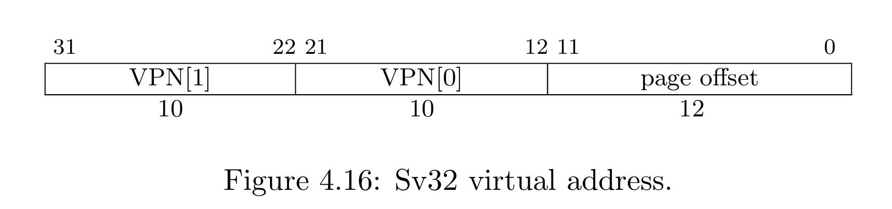
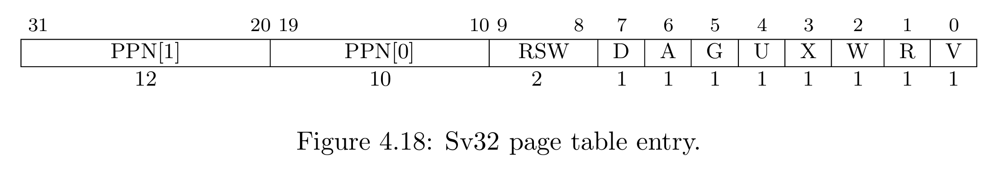
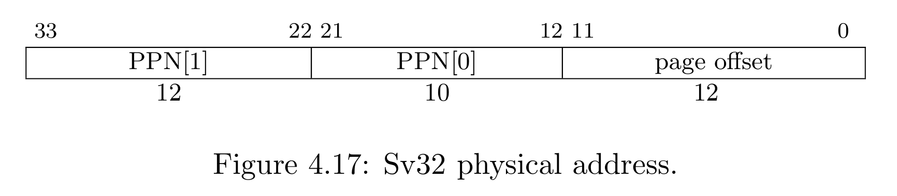
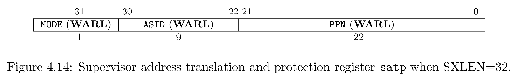
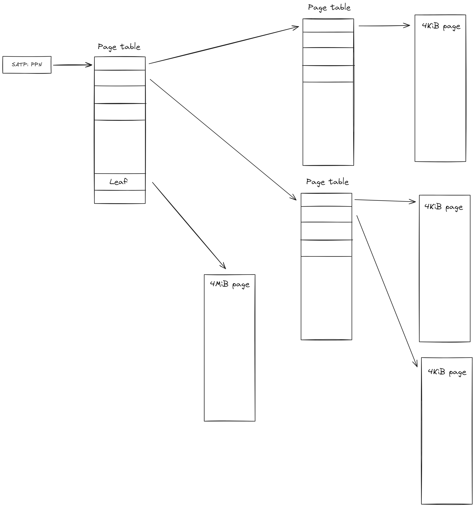
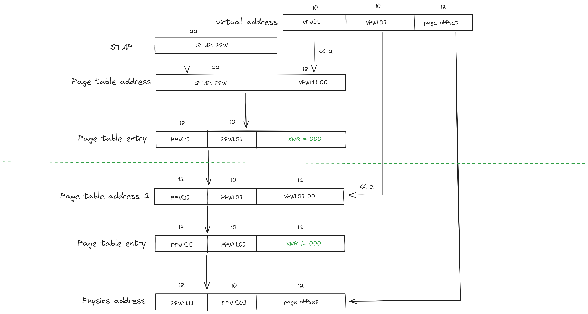
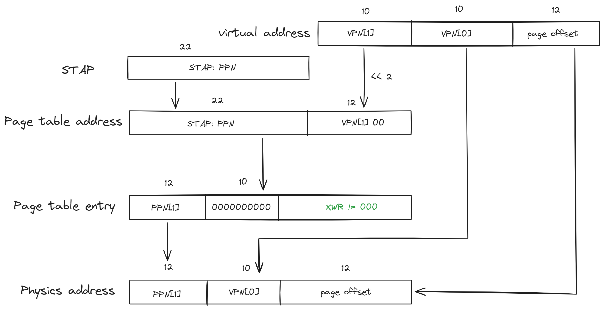
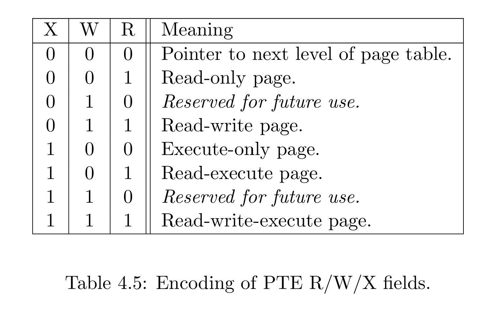

# RISC-V 虚拟内存

本节针对 Sv32, 简单介绍 RISC-V 虚拟内存规范.

虚拟内存为用户应用程序提供了隔离的内存地址空间, 使得各个用户程序可以独立的运行. RISC-V 规范中定义了 4 中虚拟内存方案, 分别为 Sv32 Sv39 Sv48 和 Sv57, 但 RV32 仅支持 Sv32, 我们假设读者接触过虚拟内存技术, 我们只在本节讲解 Sv32 虚拟内存的实现.

## 虚拟地址、页表项和物理地址

Sv32 规定虚拟地址为 32 位:

其中 `VPN[1]` 字段为虚拟页号 1, `VPN[0]` 字段为虚拟页号 0, `page offset` 为页内偏移.

由此可见 Sv32 是一种两级页表结构, 同样, Sv32 规定页表项的格式为:

每个页表项依然是 32 位, `PPN[1]` 字段为实页号 1, `PPN[0]` 字段为实页号 0, 剩下的几位为标志位, `V` 位指示该页表项是否有效, `XWR` 位指示对应页的权限.

Sv32 规定的物理地址为 34 位:

其中 `PPN[1]` 字段为实页号 1, `PPN[0]` 字段为实页号 0, `page offset` 为页内偏移.

## 地址索引

Sv32 采用两级页表结构, 物理地址中 `page offset` 字段的长度为 12-bit, 因此一个物理页的大小为 4KiB, 即通过两级索引页表可以定位一个 4KiB 的物理页. 但是为了提高内存效率, Sv32 允许超级页索引, 即只索引一次页表项, `PPN[0] + page offset` 全部作为页内偏移, 总共 22-bit 长度, 对应的物理页大小为 4MiB.

那如何区分虚拟地址所在的页是 4KiB 页还是 4MiB 页呢? 若页表项 `XWR` 字段的值为 `000` 则指明该页表项不是叶子页表项, 需要二次索引, 对应的页固然也就是 4KiB 页, 若不是 `000` 说明该页表项为叶子页表项, 不需要二次索引, 对应的页固然也就是 4MiB 页.

索引一个虚拟地址需要知道根页表在哪里, CSR 中的 `stap` 寄存器存放了根页表的物理地址, 下图是规范中规定的寄存器格式:

`MODE` 字段表示是否开启分页, 若为 0 则不开启, 所有指令产生的地址均为物理地址. 若为 1 则开启, 所有指令产生的地址均为虚拟地址.

`ASID` 指示当前虚拟地址空间的 ID 号. `PPN` 为根页表所在的物理页号.

所以, Sv32 地址索引的结构类似于下图的结构:

memory-construction

下面是地址索引的过程:

1. 获得 `stap` 寄存器中的根页表所在的虚拟页号 `PPN`
2. 将 `PPN` 左移 12 位(12 位为页内偏移, 一个页表占一个 4KiB 物理页) 得到 34 位根页表的物理地址.
3. 将虚拟地址中的 `VPN[1]` 左移 2 位(一个页表项的大小固定为 32 位, 后两位恒为 0) 得到页表项的 12 位页内偏移.
4. `PPN << 12 + VPN[1] << 2` 即为一级页表项的物理地址, 检查该页表项的 `XWR` 为是否为 `000`
5. 若不为 `000` 说明该页表项为叶子页表项, 叶子页表项的 `PPN[0]` 字段必须为 0, 拼接虚拟地址和表项中 `PPN[1] << 22 + VPN[0] << 12 + page offset` 得到 34 位物理地址, 结束过程.
6. 若为 `000` 说明该页表项不是叶子表项, 需要二级索引, 拼接虚拟地址和表项中 `PPN[1] << 22 + PPN[0] << 12 + VPN[0] << 2` 即为二级页表项的物理地址, 检索该页表项.
7. 二级页表项中的 `XWR` 一定不为 `000`, 拼接虚拟地址和二级表项中 `PPN[1] << 22 + PPN[0] << 12 + page offset` 得到物理地址, 结束过程.

下图展示了二次索引的过程:

下图展示了一次索引的过程:

:::tip 34 位物理地址

读者可以发现, Sv32 方案采用了 34 位物理地址索引, Sv32 增大了物理内存的索引能力, 可以安装大于 4GB 的物理内存, 但是虚拟内存地址仍是 32 位的, 虚拟内存空间依然是 4GB.

:::

## 页标识

在页表项中, 存在许多页标识, 其中 `V` 标识指示页表项是否有效, 若为 0 则说明页表项无效, 若指令索引了该页表项, 则需要触发一次页异常(page fault).

`XWR` 标识指明叶子页的权限:

若指令索引了该页表项, 但是权限不满足, 则需要触发一次页异常(page fault).

`U` 表明页是否是一个用户页, `G` 表明是否是一个全局页, `D` 和 `A` 用于操作系统的页替换算法, `RSW` 为保留位, 关于这几个标识的具体规则请查阅 RISC-V 规范文档.

## ASID

ASID 称为地址空间 ID 号, 我们知道, 一般来说一个进程对应一个虚拟地址空间, 在处理器执行过程中, 可能会发出很多相同的虚拟地址, 但这些虚拟地址却对应不同的物理地址, 我们怎么知道是哪个进程的虚拟地址呢?

例如, 对于 BTB 分支缓存, 我们需要知道缓存记录的虚拟地址是哪一个虚拟地址空间的虚拟地址, 此时我们就需要记录 ASID 号, 一个 ASID 唯一的确定了一个虚拟地址空间.

ASID 是由操作系统分配的, 一般来说一个进程对应了一个 ASID.

## 内存模型

RISC-V 采用 RVWMO 内存模型, 关于 RVWMO 内存模型, 作者曾经写过一篇关于该内存模型的规范总结 [RISC-V RVWMO 内存模型解释](https://blog.csdn.net/jiahonghao2002/article/details/135819701).

在 Bergamot 中, 由于不涉及多核共享内存问题, 我们仅使用写缓冲内存模型实现, 因此不在这里讨论过多复杂的内存模型实现.
