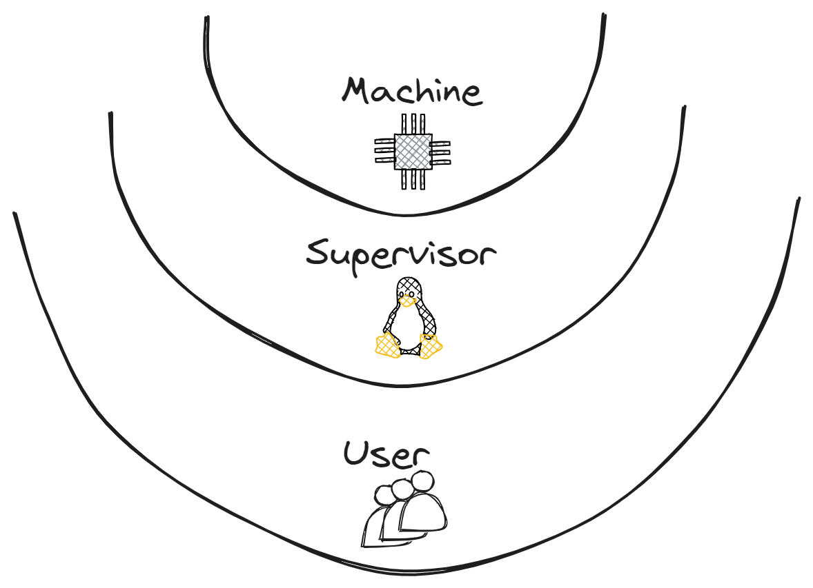
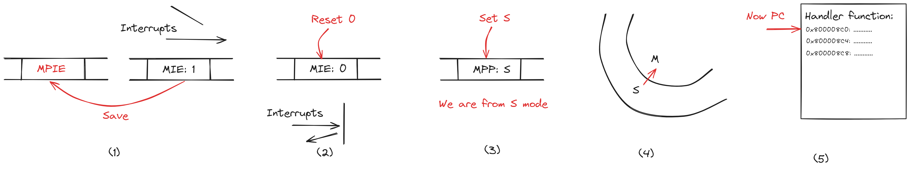
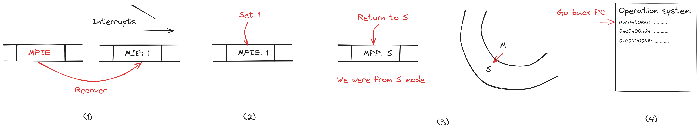
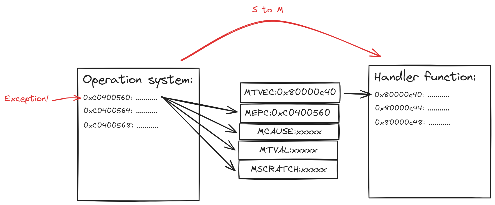
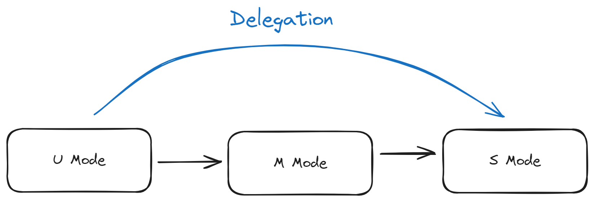

# RISC-V 特权模式

本节主要介绍 RISC-V 对通用计算的支持, 在 RISC-V 中总共有三种特权模式: 机器模式(M)、监管模式(S)、用户模式(U).

- 机器模式: 用于执行最高可信代码
- 监管模式: 用于执行操作系统
- 用户模式: 用于执行用户程序

RISC-V 中通过异常和中断发生特权模式跳转.

## 特权跳转

在 mstatus 中, 和特权相关的位总共有三种, 分别为 `xIE` `xPIE` `xPP` , 这里 `x` 指特权字母M、S、U.

`xIE` 为全局中断开关, 目前可以理解为在 `x` 特权级下面是否可以发生中断.

假设当前特权级处于 S, 此时发生异常或中断, 特权级将跳转至 M, 将会发生一系列行为:

1. `MPIE` 的值设为当前 `MIE` 的值.
2. `MIE` 的值设为 0, 禁用 M 特权下的中断.
3. `MPP` 的值设置为 S.
4. 进入 M 特权模式.
5. 跳转 PC 到中断或异常处理程序执行 M 特权模式代码.

由此可见, `MPIE` 的作用是记录进入 M 模式之前的 `MIE` 的值, `MPP` 的作用是记录从哪一个模式进入的 M 模式. 这两个位的值将在退出 M 模式的时候, 作为恢复寄存器使用, 即将 M 模式下的 `MIE` 恢复到原先的值, 并返回到原来的模式.

之后, 当 M 模式下的处理代码执行完毕, 将通过一个 `mret` 指令返回到原先的模式, 过程为:

1. 将 `MIE` 的值设为 `MPIE`.
2. `MPIE` 的值设为 1.
3. 返回 `MPP` 模式, 在上述假设的情况下为 S.
4. 跳转 PC 到异常或中断断点处继续执行.

对于 U 到 S, U 到 M 的处理也是相同的过程.

:::danger mstatus 没有记录当前模式的字段
出于安全考虑, mstatus 没有记录当前硬件线程所处模式的字段, RISC-V 将记录当前硬件线程所处模式的功能委托给具体的硬件实现. RISC-V 程序是没有办法通过指令知道自己处于什么模式下, 几乎所有的程序的执行模式是固定的, 因此也不必提供这种查询机制, 例如操作系统代码知道自己执行在 S 模式下, 而用户模式代码知道自己应该执行在 U 模式下.
:::

## 异常与中断

异常与中断是 RISC-V 特权模式的核心, RISC-V 特权模式的切换控制全部依靠异常与中断.

### 异常

#### 异常跳转

和异常相关的寄存器有 `xtval` `xcause` `xepc` `xedeleg` `xtvec` `xscratch`.

当 y 模式下一条指令发生异常的时候, 若将触发从 y 模式跳转到 x 模式, 则启用的是 x 模式下的 CSR 异常寄存器组, 而不是 y 模式下的, 例如从 S 模式下的异常跳转到 M 模式下处理, 则启用 `mtval` `mcause` `mepc` `medeleg` `mtvec` `mscratch`.

例如, 当 M 模式的异常发生时, 我们首先要知道该异常处理程序的地址在哪里, 其储存在 `mtvec` 中, 异常不参与向量中断地址, 因此 `mtvec` 中即是异常处理程序的地址.

其次, 我们保存当前的程序断点, 将断点的 PC 储存在 `mepc` 中.

异常处理程序需要通过查询 `mcause` 寄存器中的值来判断发生了何种异常, 因此异常发生时需要将 `mcause` 设为异常类型, RISC-V 规范定义为多种异常, 具体请参考官方规范.

`mtval` 储存额外的异常信息, 辅助异常处理程序进行异常处理. `mscratch` 一般用于保存 M 模式下的局部硬件上下文的地址, `mtval` 和 `mscratch` 的具体用处取决于操作系统如何使用.

总结如下, 当 M 模式异常发生时:

1. 将断点的 PC 储存在 `mepc` 中.
2. 将 `mcause` 设置为当前发生的异常类型.
3. 设置 `mtval` 和 `mscratch`.
4. 完成 S 模式到 M 模式的切换.
5. 跳转 PC 为在 `mtvec` 设置的异常处理程序地址.

注意, 在 RISC-V 规范中, 定义了三种特别的异常类型和一个指令 `ecall`:

- 8: Environment call from U-mode
- 9: Environment call from S-mode
- 11: Environment call from M-mode

`ecall` 称为环境调用指令, 当在 U 模式下调用 `ecall` 会触发异常 Environment call from U-mode, 当在 S 模式下调用 `ecall` 会触发异常 Environment call from S-mode, 当在 M 模式下调用 `ecall` 会触发异常 Environment call from M-mode. 这些异常被称为程序自愿触发的异常, 在某些书籍资料中里面被称为自陷(Trap), 但是在 RISC-V 中, 异常和中断被统称为 Trap.

`ecall` 指令对特权的实现至关重要, 例如:

- 当用户程序想请求操作系统例程的时候, 可以通过 `ecall` 进行调用, 这一般称为系统调用(System call).
- 当操作系统想请求 M 模式下关于硬件例程时候, 例如 OpenSBI, 可以通过 `ecall` 进行调用.

另外, 如果想从高特权模式进入低特权模式, 例如从 M 模式进入 S 模式, 通常是在操作系统启动的时候, 从 M 模式进入 S 模式下的操作系统, 可以通过:

1. 设置 `mepc` S 模式执行地址.
2. 设置 `MPP` 为 S.
3. 执行 `mret` 返回.

#### 异常返回

基于上面的假设, 当 M 模式下处理完异常之后, 要将控制权重新交给 S 模式并返回当前程序断点, RISC-V 设计了 `mret` 指令来完成这件事情.

当执行 `mret` 指令时:

1. 完成 M 模式到 S 模式的返回.
2. 跳转 PC 为在 `mepc` 保存的程序断点.

同理 `sret` 用于从 S 模式返回.

#### 异常委托

最后的一个问题是, 假如在 U 模式下发生的异常, 如何知道应该让 S 模式处理还是让 M 模式处理? 为此 RISC-V 设计了一套委托异常机制.

默认情况下, 所有的陷入(Trap = Exception + Interrupt) 都应该交给 M 模式处理, 并通过 `mret` 指令返回. 若 U 模式想跳转进入 S 模式, 必须先跳转到 M 模式, 再从 M 模式通过 `mret` 进入 S 模式处理, 处理完毕之后, 再通过 `sret` 返回到 U 模式, 为了减少不必要的跳转, 增加性能, 委托异常机制可以将 M 模式下的异常委托给 S 模式, 使得 U 模式下的异常处理可以直接交给 S 模式, 不必再通过 M 模式中转.

`medeleg` 设置 M 模式下的异常委托, `medeleg` 寄存器中每一位对应一个异常.

注意: **所有的陷入(Trap) 委托都不会从高级的特权模式跳转到更低级的特权模式.** 例如, 当 A 异常在 `medeleg` 设置委托, 若在 M 模式下发生 A 异常, 则仍在 M 模式下处理 A 异常, 不会进入 S 模式, 而若在 S 或 U 模式下发生 A 异常, 则使用 S 模式处理该异常, 而不是进入 M 模式.

最后需要注意, 当前最新的规范没有 `sedeleg` 寄存器, 即不存在 S 模式下的代理, 只能将 M 模式异常处理代理给 S 模式处理.

### 中断

异常通过指令触发, 而中断需要靠处理器外部中断源触发.

和中断相关的寄存器有 `mstatus` `xtval` `xcause` `xepc` `xideleg` `xtvec` `xscratch` `xie` `xip`.

#### 中断跳转

与异常不同, **中断是可以被屏蔽的, 而异常不可以被屏蔽**, 在 `mstatus` 寄存器中, 有两个全局中断开关 `MIE` 和 `SIE`, 同时 `xie` 寄存器可以精确的控制启用或是屏蔽哪一个中断.

同时, RISC-V 规范规定, 中断为特权中断, 即一种类型中断分为两种特权类型不同的中断, 目前总共有 6 种不同的中断:

- MEI: M 模式外部中断
- SEI: S 模式外部中断
- MTI: M 模式时钟中断
- STI: S 模式时钟中断
- MSI: M 模式软件中断
- SSI: S 模式软件中断

:::danger 软件中断
软件中断(Software interrupt) 用于多核间同步, 不是 Linux 内核中的软中断(Softirq). Bergamot 不是多核处理器架构, 因此我们不讨论软件中断.
:::

全局中断开关提供了一种简单的原子性机制, 若当前模式处于 M 模式, 并且 `MIE` 设为 0, 则在 M 模式下永远不会发生中断处理.

中断处理跳转和异常处理跳转的过程的相似, 但有两个不同的地方, 第一, 中断支持向量中断, RISC-V 规定, 若启用中断向量, 中断处理程序的地址为 `xtvec` 的地址 + 中断号 * 4.

第二, 若发生中断 i 请求, 则必须将 `xip` 寄存器对应的位 i 置为 1. `xip` 中的位可以是可写的, 也可以是只读的, 若是可写的, 则软件程序可以自己触发中断或者清除中断请求, 若是只读的则硬件实现必须通过某种机制, 可以让中断处理程序清除中断请求.

#### 中断返回

中断处理返回和异常处理返回的过程的相似, 唯一区别的地方在于处理 `xip`, 当中断处理程序响应完中断后, 需要通知外设中断已经处理, 若 `xip` 的某些位是只读, 则需要通知外设撤销中断请求, 此时请求位恢复为 0. 若是可写的, 软件可以手动将这些位置 0, 以清除中断请求.

#### 中断委托

默认的, 所有的 6 种中断都是在 M 模式下处理, 中断同样也有委托, 相关的寄存器为 `mideleg`.

RISC-V 规范中给出了形式化的中断处理条件:

若异常 i 会被 M 模式下处理(发生到 M 模式的特权跳转), 必须全部满足下面3个条件:

1. 当前特权级为 M 模式并且 `MIE` 为 1, 或者, 当前特权级为 U 或者是 S 模式.
2. 在 `mip` 和 `mie` 寄存器中异常 i 所在的位被置为 1.
3. 在 `mideleg` 寄存器中异常 i 所在的位被置为 0, 即异常 i 没有被代理.

若异常 i 会被 S 模式下处理(发生到 S 模式的特权跳转), 必须全部满足下面3个条件:

1. 当前特权级为 S 模式并且 `SIE` 为 1, 或者, 当前特权级为 U 模式.
2. 在 `sip` 和 `sie` 寄存器中异常 i 所在的位被置为 1.