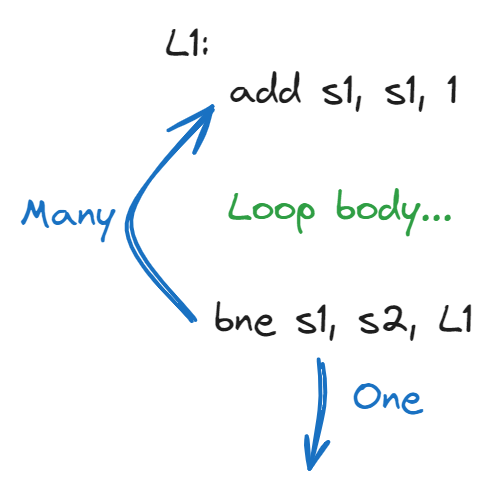
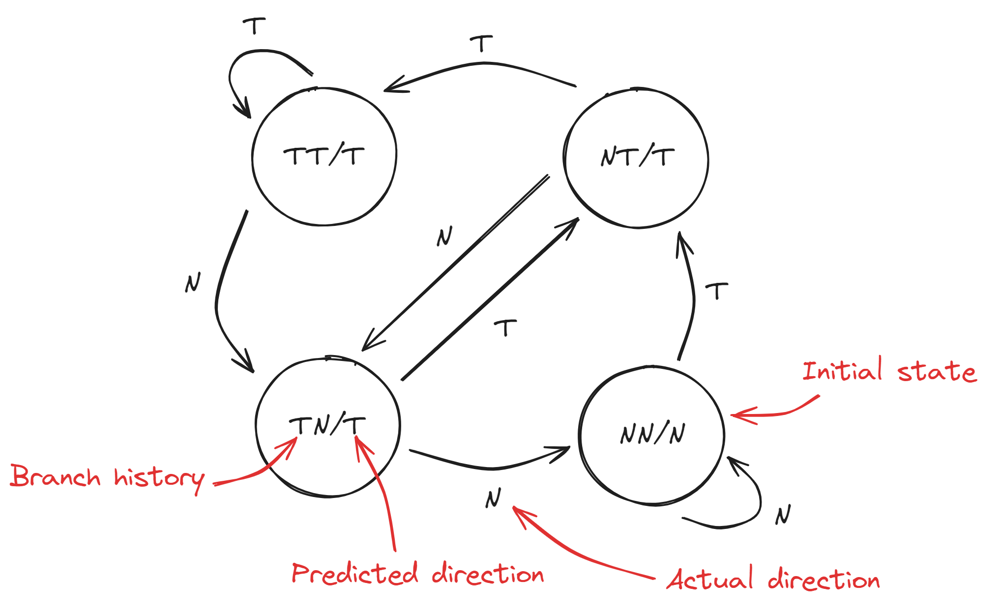
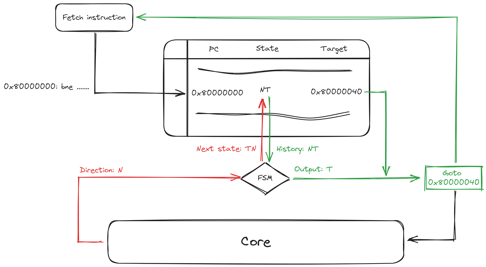

# 分支预测

为了充分利用流水线架构, 我们想让更多的指令进入流水线, 这需要让一些指令提前进入流水线, 但分支指令的存在, 选择要进入流水线的指令就变得更加困难, 因此我们就必须使用分支预测.

## 动态分支预测

Bergamot 使用动态分支预测, 因此本文重点关注动态分支预测技术.

动态分支预测是一种 **基于一条分支语句过去的行为** 的分支预测技术. 程序中的分支语句一般用于执行循环迭代等操作, 基于此, 一条分支语句的跳转行为可能和之前的跳转结果有关.

例如下图的迭代语句, 此 `bne` 分支语句将一直发生多次跳转直到 `S1 = S2` .

### BTB 表

为了记录分支语句的过去结果, 像寄存器重命名表一样, 我们同样需要一张表结构来记录, 我们称为 BTB(Branch Target Buffer) 表:

|     PC     | 状态 |    跳转地址  |
|      -     |  -  |       -     |
| 0x80000000 |  X  |  0x80000040 |
|     ...    | ... |      ...    |

`PC` 列表示一个跳转指令的 PC 内存地址.

:::tip 虚拟 PC 地址

当核心进入内存分页模式下, PC 和跳转地址为当前分页的虚拟地址, 需要跟踪地址空间的 ASID, 我们将在 RISC-V 内存分页中详细介绍.

:::

`状态` 列表示该跳转指令的过去结果.

`跳转地址` 列表示该跳转指令上一次跳转到的位置.

### 2-bit 状态

目前的问题是, 如何量化一个分支指令过去的结果? 一种经典的方案是使用一个 2-bit 位来记录一个分支指令过去的结果, 称为 **2-bit 状态动态分支预测** .

| Bits | 状态 |                 说明                           |
|   -  |  -  |                  -                             |
|  00  |  NN |  在过去最近的两次执行中, 该指令都没有发生跳转         |
|  01  |  NT |  在过去最近的两次执行中, 分别发生了一次跳转一次没有跳转 |
|  10  |  TN |  在过去最近的两次执行中, 分别发生了一次没有跳转一次跳转 |
|  11  |  TT |  在过去最近的两次执行中, 发生了两次跳转              |

由此可见, 2-bit 状态只能根据最近的两次结果来预测本次的跳转结果, 大量实验结果表明虽然只有 2-bit 状态, 但预测的准确率也十分可观.

那么我们该如何更新一条分支指令的状态呢? 我们将元组 `(上一次的状态, 本次的结果)` 作为输出, 将 `新的状态` 作为输出, 构造状态机 `(上一次的状态, 本次的结果) -> 新的状态` .

:::tip 不同的FSM

满足 `(上一次的状态, 本次的结果) -> 新的状态` 的状态机有很多不同的实现, 并且每种实现面对不同的程序性能有不同的反应, 本文我们只采用其中一种.

:::

### 动态分支预测过程

动态分支预测组件由上述两者组成, 一个完整的动态分支预测过程由下面的子过程组成:

1. 指令预取组件获取到分支指令.
2. 查询 BTB 表, 是否有匹配的 PC 表项.
3. 根据状态列预测分支指令是否发生跳转.
4. 若发生跳转, 通知预取组件更新 PC.
5. 当该分支指令执行完毕, 根据结果判断是否进行预测恢复.
6. 若预测结果和执行结果不一致, 则执行分支恢复, 恢复核心状态, 通知预取组件更正 PC.
7. 使用 `(上一次的状态, 本次的结果)` 查询状态机, 更新 BTB 表项.
8. 若 BTB 表没有当前分支指令项, 向 BTB 插入当前分支指令项.

### 表项替换算法

最后一点, 因为 BTB 表是无限大表, 但是受实际限制, 当一个新表项插入并且 BTB 表满时候, 就需要通过表项替换算法来替换一个旧表项, 以插入一个新表项.

在 Bergamot 中, 我们为了实现的简洁性, 使用顺序随机替换算法, 即设置一个 `victimPtr` 指针, 指针指向的表项就是可以替换的旧表项, 并且在每次的替换周期自增, 实现顺序随机替换算法.

## Bergamot 中的动态分支预测

