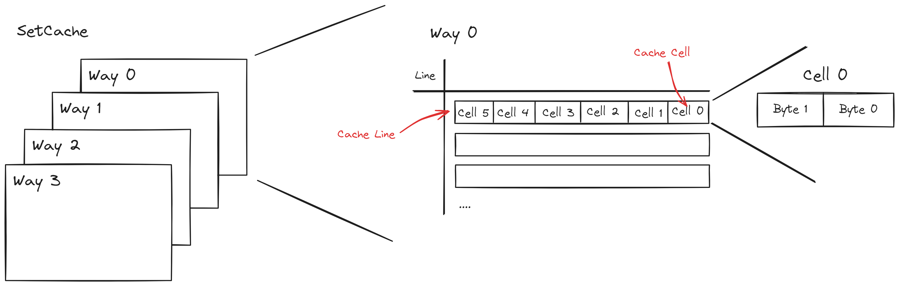

# 总线与缓存

总线是处理器和外界进行 I/O 通讯的主要办法, 缓存用以改善处理器的 I/O 性能.

## Bergamot 总线

Bergamot 总线采用两种总线, 一种用于核心内 I/O 称为简单内存访问总线(SMA, Simple memory access), 另外一种用于处理器和外界外设进行通讯, 称为 AXI4-Lite.


### AXI4-Lite

Bergamot 中总线目前采用 [ARM® AMBA® AXI4-Lite Protocol](https://developer.arm.com/Architectures/AMBA) 作为片内总线协议.

由于其简单而又不失功能, 因此作为 Bergamot 总线实现的最佳之选.

AXI4-Lite 包含 5 个独立的通道, 分别是:

- 写请求(AW)
- 写数据(W)
- 写响应(B)
- 读请求(AR)
- 读数据(R)

```scala title="src/main/scala/bergamot/bus/AXI.scala"
class AXIMasterIO extends Bundle {
  // Write request channel (AW)
  val AWVALID = Output(Bool())
  val AWREADY = Input(Bool())
  val AWADDR = Output(UInt(AXISpec.addressWidth.W))
  val AWPORT = Output(UInt(AXISpec.portWidth.W))

  // Write data channel (W)
  val WVALID = Output(Bool())
  val WREADY = Input(Bool())
  val WDATA = Output(UInt(AXISpec.dataWidth.W))
  val WSTRB = Output(UInt((AXISpec.dataWidth / 8).W))

  // Write response channel (B)
  val BVALID = Input(Bool())
  val BREADY = Output(Bool())
  val BRESP = Input(UInt(AXISpec.respWidth.W))

  // Read request channel (AR)
  val ARVALID = Output(Bool())
  val ARREADY = Input(Bool())
  val ARADDR = Output(UInt(AXISpec.addressWidth.W))
  val ARPORT = Output(UInt(AXISpec.portWidth.W))

  // Read data channel (R)
  val RVALID = Input(Bool())
  val RREADY = Output(Bool())
  val RDATA = Input(UInt(AXISpec.dataWidth.W))
  val RRESP = Input(UInt(AXISpec.respWidth.W))
}
```

每个通道都通过 `(READY, VALID)` 信号组进行握手, 例如一次写过程的时序图为:


关于 AXI4-Lite 更多细节请参考官网文档.

### SMA

在 Bergamot 的设计思路中, AXI4-Lite 总线仍然较为复杂, 需要复杂的状态机驱动, 增加了核心的实现难度和复杂性, 基于此原因, 我们简化了 AXI4-Lite 的逻辑, 最后把 SMA 作为核心内总线.

在 SMA 中, 将读接口 `SMAReaderIO` 和写接口 `SMAWriterIO` 分离设计, 因为我们发现不同的部件可能仅仅只需要读逻辑或是写逻辑.

```scala title="src/main/scala/bergamot/bus/SMA.scala"
class SMAReaderIO extends Bundle {
  // Out
  val address = Output(UInt(SMASpec.addressWidth.W))
  val readType = Output(MemoryAccessLength())
  // In
  val data = Input(UInt(SMASpec.dataWidth.W))
  val error = Input(Bool())
  // Handshake signals
  val valid = Output(Bool())
  val ready = Input(Bool())
}

class SMAWriterIO extends Bundle {
  // Out
  val address = Output(UInt(SMASpec.addressWidth.W))
  val data = Output(UInt(SMASpec.dataWidth.W))
  val writeType = Output(MemoryAccessLength())
  // In
  val error = Input(Bool())
  // Handshake signals
  val valid = Output(Bool())
  val ready = Input(Bool())
}
```

我们规定:

1. 当 `valid` 信号拉高, 即视为主机发送一次请求, 同时主机数据应该准备好.
2. 当 `valid` 信号拉高时, 直到完成本次通讯, 主机数据和 `valid` 都应该保持不变.
3. 当从机执行完操作, 将 `ready` 信号拉高, 同时从机响应数据应该准备好.
4. 当 `valid` 和 `ready` 信号同时拉高的时候, 视为一次传输. 主机和从机依次撤销这两个信号.


## Bergamot 缓存

在 Bergamot 中, 高速缓存(Cache) 目前仅有一种实现 `SetCache`, 该实现是:

- 组相连(Set-associative cache)
- 随机替换
- 写穿型(Write-through)
- 写不分配(Write without allocation)


Bergamot 总共有两级 Cache 分别为 L1-Cache 和 L2-Cache, 其中 L1-Cache 由 I-Cache 和 D-Cache 组成.

I-Cache 负责缓存内存中的指令, D-Cache 负责缓存内存数据读写.

L2-Cache 作为核心通用型 Cache.


### 缓存行

Bergamot 的缓存由缓存行(Cache line) 组成, **缓存行是一次缓存请求的最小单位**，缓存行又由缓存单元(Cache cell) 组成.

Bergamot 考虑到 RISC-V 的压缩指令长度为 16-bit, 为了访存方便, 因此将缓存单元的大小固定为 16-bit, 由两个字节组成.

