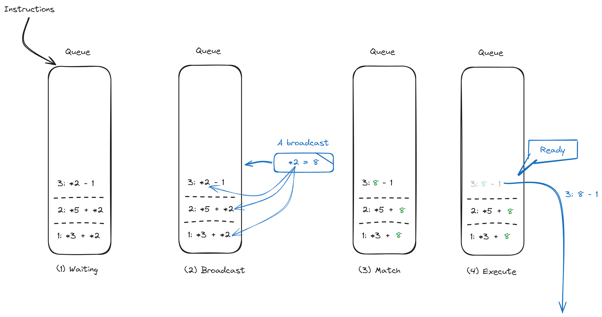
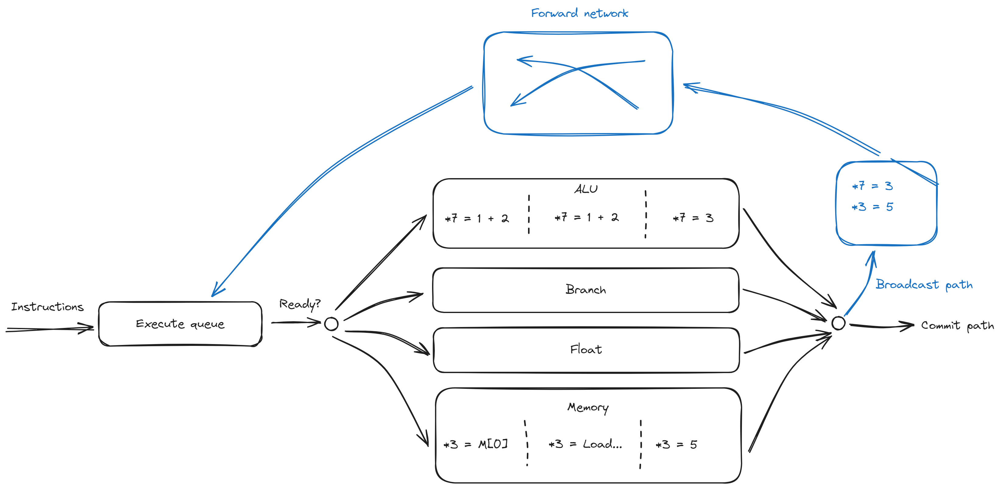

# Bergamot 数据广播

上一章我们简单介绍了一条指令是如何获取它的源寄存器的值的, 其中提到了一种重要的方式, 即数据广播.

一条典型的数据广播包含一个之前分配的数据凭证, 以及数据凭证对应的结果, 例如:

```plain
*3 = 13
```

表示数据凭证为 3, 结果为 13.

## 指令暂存队列

在指令完成寄存器重命名之后, 指令进入 **指令暂存队列** 中, 指令暂存队列暂存那些源数据还没准备好, 和那些已经准备好源数据但是还没进入执行流水线的指令.

除了上一章的寄存器重命名表, 指令暂存队列是另外一个数据广播接收终端, 指令暂存队列中的每一条指令都在监听来自核心的数据广播, 检测是否有自己正在监听的数据凭证, 从而捕获源数据, 称为 **数据捕获** .

通过此方式, 我们可以方便的管理指令间 RAW 依赖, 而不用实现复杂的数据前馈逻辑.



当所有的源数据都准备好时, 通过合适的指令调度, 该指令就可以进入执行流水线了.

## 发送数据广播

在 Bergamot 总共有 2 两个数据广播接收端:

1. 寄存器重映射表
2. 指令暂存队列

那么我们何时发送数据广播呢?

数据广播中的数据来自于指令执行的结果, 当指令执行完毕, 即退出执行流水线的的时候, 数据广播就可以发送了, 而不需要等到指令退休才发送, Bergamot 就使用这种方式进行发送数据广播.

Bergamot 通过调度算法, 每次从四个执行流水线(ALU, Branch, Memory, FPU) 中选择两个执行完毕的指令, 发送其数据广播.



## 数据广播项

数据广播项由 `receipt` 数据凭证, 和 `data` 数据组成.

```scala title="src/main/scala/bergamot/core/broadcast/BroadcastEntry.scala"
class DataBroadcastEntry extends Bundle {
  // Broadcast receipt
  val receipt = DataType.receipt
  // Data
  val data = DataType.operation
  val valid = Bool()
}
```


