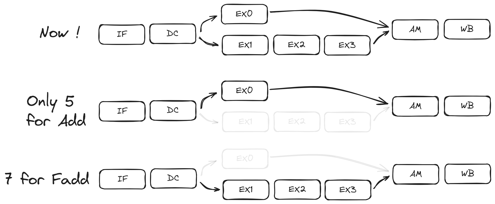

# 从单流水到多流水

## 多周期单流水处理器

现在假设我们需要设计一款最基础的处理器, 该处理器仅包括最简单的 ALU 指令、内存指令和分支跳转指令. 任何一本计算机体系结构或是数字电路的书籍都会介绍多周期单流水处理器的设计与实现方法.

下图展示了一个最经典的 5 级多周期单流水处理器的设计(来自 《Digital Design and Computer Architecture: RISC-V Edition》):

从左到右依次是取指、译码、ALU 执行、访存、写回, 总共 5 个阶段.

该设计能够完美的完成我们所需要的目标, 但是一个通用处理器的功能要求更多, 例如, 我们希望处理器能够计算硬件浮点数, 因此我们需要在上图的设计中加入浮点数相关的处理单元.

### 合并添加

我们所面对的问题是, 在哪里以及如何添加新的功能单元? 一种直接的解决方案是在 ALU 执行阶段加入我们的硬件浮点单元, 使用数据选择器来选择合适的数据路径.

这种方案有一个很明显的缺点, 我们知道计算浮点数要比计算小数复杂的多, 因此硬件浮点单元的单次周期时间远大于整数计算, 若使用该方案将增大 ALU 执行阶段的时间长度, 整个处理器的单次周期时间将会严重拉长, 造成严重的性能损失.

### 更多级的流水

解决方案也很简单, 依然采用多周期单流水的设计思路, 继续细分 FPU 的周期, 将 FPU 也变成多周期操作, 我们的处理器将从 5 级增加到 7 级甚至更多.

若细分 FPU 的周期, 则会引入更加复杂的问题: 冒险(Hazard). 在设计多周期单流水处理器中, 处理冒险并不是一件简单的事情, 需要我们合理的安排每一个阶段周期在整个指令周期中的位置以及复杂的冒险处理路径, 包括控制路径、数据前馈(Data forward)等. 结论是, 扩展指令周期虽然减少了单个周期的时间, 但是却大大增加了电路逻辑设计上的复杂性.

还有另外一个相对不是那么主要的问题, 假如一段指令都是 ALU 指令, 例如一个函数只做整数运算, 若采用该方案, 无论指令是什么类型, 每一个指令都需要经过一次 FPU 周期, 尽管该指令不执行 FPU 操作, 这样原本 5 个周期就可以完成的 ALU 指令, 现在却需要 7 个以上的周期执行, FPU 部件就会产生空档现象, 白白浪费了周期时间.

如果我们换一种思考方法, ALU 和 FPU 计算并无直接的关联, 或许我们可以让他们并行执行.

## 多周期多流水处理器

从功能依赖性方面来看, 一个指令内 ALU 部件和 FPU 部件并没有相关的依赖性, 或许我们可以将其分开, 并行执行.

从图中看起来似乎该方案是前两个方案的结合版本: **一个指令通过一个数据选择器, 选择需要的处理路径, 不同处理路径相互独立流水执行.**

该方案相比前两个方案有什么好处呢？

- 执行时间独立: 尽管每条路径的执行周期数不同, 但是较短的路径可以比较长的路径先执行完指令, 而不需要互相等待.
- 灵活添加执行单元和路径: 不仅仅是 FPU, 我们可以添加更多的相互独立并行的执行单元完成不同的指令操作.
- 简单的逻辑: 我们仅仅需要一个前端的路径选择器即可完成执行路径的判断, 而且通过前馈网络, 免去了各种处理冒险的麻烦(稍后我们介绍如何使用前馈网络消除冒险).
- 更大的并行度. 现在, 更多的指令可以同时执行, 提高了处理器性能.

## Bergamot 中的多流水

一个通用 RISC-V 处理器具有复杂的 ALU、分支、访存、FPU 过程. 因此在 Bergamot 依照此分类方案, 实现了 4 路并行的功能单元路径:

- ALU: 主要执行类似整数加减乘除的 ALU 指令.
- Branch: 主要执行分支指令.
- Memory: 主要执行内存操作指令.
- FPU: 主要执行硬件浮点指令.

:::tip 为什么要将 ALU 和 Branch 分开

很多实现中, 将 Branch 与 ALU 合并为一条路径, 而在 Bergamot 中, Branch 与 ALU 并行执行, 加快分支指令的执行速度, 降低预测失败惩罚(Penalty).

:::

暂时, 我们先可以忽略每个路径中的每个子周期阶段的实现细节, 先让我们继续我们的超标量旅程.