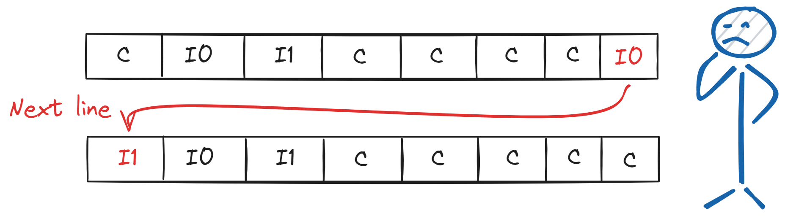
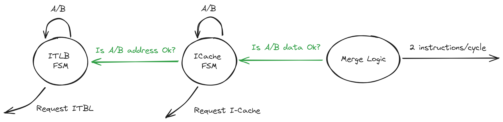

# 指令预取

现在我们来到处理器的最前端, 指令预取.

指令预取根据当前 PC 预取寄存器中的值, 从内存中获取指令, 一般情况下指令是顺序执行的, 每次获取完指令执行 `PC = PC + 1` . 若核心需要分支预测和分支恢复, 则需要修改 PC 预取寄存器值指向预测路径或是正确的路径的 PC.

## 指令跨行

Bergamot 支持 RISC-V I 和 C 两种指令格式, 其中 I 的指令长度为 32-bit 而 C 的长度为 16-bit. 根据上一节缓存行的格式, 一个 C 指令正好占用一个缓存单元, 一个 I 格式指令需要占用两个缓存单元.

由于不同的指令长度, 一个 I 指令可能存在跨越一个缓存行的情况:

Bergamot 的解决办法是, 预取两个缓存行: **获取当前PC所在的缓存行和下一个缓存行** .

在下文, 我们称当前PC所在的缓存行为 A 行, A 行下一个缓存行为 B 行.

当检测到指令跨行的时候, 由于我们预取两个缓存行, 一个跨行的 I 指令可以因此拼接起来.

## 三大状态机

Bergamot 的指令预取组件 `InstructionFetcher` 由两个相互独立工作的状态机和一个指令拼接逻辑组成:

- ITLB FSM: 负责解析 A 行和 B 行的物理地址.
- ICache FSM: 负责预取 A 行和 B 行.
- 指令拼接逻辑: 负责拼接跨行的指令, 最大吞吐量为 2指令/周期.

ITLB FSM 实时检测 PC 预取寄存器的变化, 若 A 行需要解析物理地址则先解析 A 行的物理地址, 若 B 行需要解析物理地址则解析 B 行的物理地址. ICache FSM 检测 A 行和 B 行是否需要预取, 当 A 行需要预取并且 A 行的物理地址已经解析完成, 则通过物理地址请求 A 行, 接下来处理 B 行的请求.

指令拼接逻辑实时检测 A 行和 B 行是否已经预取完成, 若当前周期能拼接出 1 条指令则输出一条指令, 若当前周期能拼接出 2 条指令则输出两条指令.

