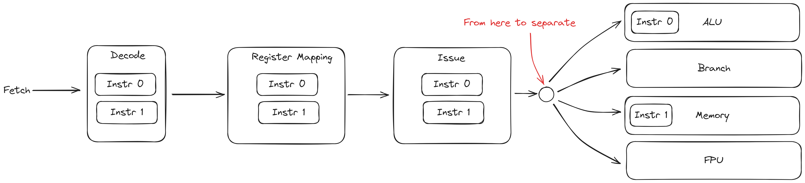

# 发射与执行

发射与执行是处理器核心的执行部件. 发射是指将译码并且经过重命名后的指令发射到执行流水线各自的指令暂存队列中, 执行是将在指令暂存队列中, 源数据已经准备好的指令进行调度, 放到执行流水线中执行指令.

## 指令发射

在指令发射之前, Bergamot 中的指令都是成对处理的, 但是一旦到了指令发射这一步, 指令开始被单独的发射到指令暂存队列中的.



指令在译码阶段被判断该指令的执行流水线, 存储在 `executeQueue` 信号中. 指令发射部件 `IssueStage` 按照指令的 `executeQueue` 值来将其发射到对应的指令暂存队列中.

指令发射部件会检测对应的指令暂存队列是否已满, 若能够在一个周期内发射两个指令则一次发射两个指令, 如不能, 则一个周期发射一条指令, 两个指令分周期依次发射.

## 指令执行

在 Bergamot 总共有四种执行流水线, 分别为:

- ALU: 执行 ALU 相关型指令
- Branch: 执行分支指令
- Memory: 执行访存指令
- FPU: 执行浮点指令

每条执行流水线的前端输入为 `ExecuteEntry` 其代表一个可执行的指令信息. 每条执行流水线的后端输出为 `ExecuteResultEntry` 表示一条指令的执行结果.

### ALU

ALU 执行流水线的分为两个阶段, `ALUDecodeStage` 和 `ALUExecuteStage`. 其中 `ALUDecodeStage` 负责对指令二次译码, `ALUExecuteStage` 计算指令结果.

```scala title="src/main/scala/bergamot/core/execute/ALU.scala"
io.in <> aluDecodeStage.io.in
aluDecodeStage.io.out <> aluExecuteStage.io.in
aluExecuteStage.io.out <> io.out
```

### Branch

Branch 执行流水线的分为两个阶段, `BranchDecodeStage` 和 `BranchExecuteStage`. 其中 `BranchDecodeStage` 负责对指令二次译码, `BranchExecuteStage` 计算分支结果.

```scala title="src/main/scala/bergamot/core/execute/Branch.scala"
io.in <> branchDecodeStage.io.in
branchDecodeStage.io.out <> branchExecuteStage.io.in
branchExecuteStage.io.out <> io.out
```

### Memory

对于 Memory 执行流水线, 分为 4 个阶段:

- `MemoryDecodeStage` 对指令二次译码
- `MemoryExecuteStage` 计算虚拟地址
- `MemoryTLBStage` 对虚拟地址进行解析, 获取物理地址
- `MemoryReadWriteStage` 对物理地址位置上的数据进行读写

```scala title="src/main/scala/bergamot/core/execute/Memory.scala"
io.in <> memoryDecodeStage.io.in
memoryDecodeStage.io.out <> memoryExecuteStage.io.in
memoryExecuteStage.io.out <> memoryTLBStage.io.in
memoryTLBStage.io.out <> memoryReadWriteStage.io.in
memoryReadWriteStage.io.out <> io.out
```

### FPU

FPU 执行流水线也分为 4 个阶段:

- `FPUDecodeStage` 对指令二次译码, 对输入的浮点数进行拆箱处理, 将 IEEE 754 格式的浮点数解析成内部格式
- `FPUMulStage` 浮点数计算第一阶段: 计算浮点乘法、除法、开根等运算
- `FPUAddStage` 浮点数计算第一阶段: 计算浮点数加法、减法等运算
- `FPUBoxStage` 浮点数装箱阶段, 将内部格式的浮点数转为 IEEE 754 格式的浮点

```scala title="src/main/scala/bergamot/core/execute/FPU.scala"
io.in <> fpuDecodeStage.io.in
fpuDecodeStage.io.out <> fpuMulStage.io.in
fpuMulStage.io.out <> fpuAddStage.io.in
fpuAddStage.io.out <> fpuBoxStage.io.in
fpuBoxStage.io.out <> io.out
```
