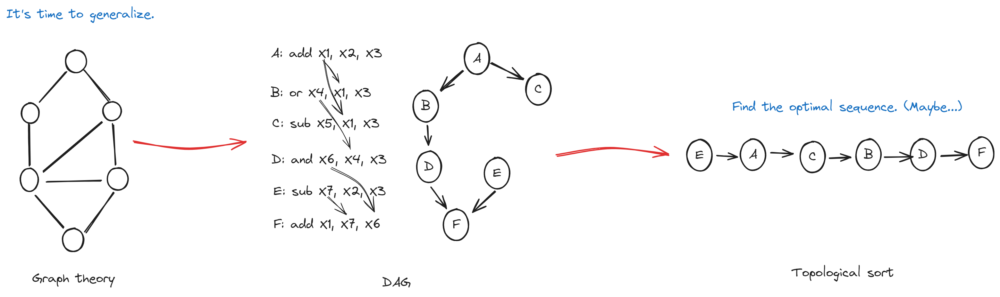

# 乱序执行

在前章, 我们介绍了 Bergamot 的数据广播架构, 其中引入了指令暂存队列的概念. 在本章, 我们重点关注于指令暂存队列的指令调度算法.

## 指令动态调度

指令暂存队列的指令调度算法是指如何在队列中选择一个源数据已经准备好的指令放入执行流水线进行执行.

指令暂存队列的指令调度算法是实现指令乱序执行的关键.

我们知道指令暂存队列中的指令是按照程序顺序进队的, 在一个队列的头部指令, 一定是同在一个队列的指令里面, 按照程序顺序中最早出现的指令.

若同在一个队列的指令之间没有除数据依赖之外的依赖性, 那么可以发现, 当一个指令的源操作数都准备好之后, 该指令即可放入执行流水线中执行, 而不用等待队列前面的指令依次执行完毕, 在指令执行视角上来看, 指令不一定按照程序顺序执行, 这种动态的指令调度策略称为 **乱序执行** .

这种动态调度策略可以形式化表示为将指令的依赖图按照拓扑顺序执行:

若指令的程序顺序为 `ABCDEF` , 指令的依赖关系为上图的 DAG 图.

按照乱序执行的策略, `AE` 可以乱序执行, 当 `AE` 执行完成之后 `BC` 同样可以乱序执行, 最后 `D` 和 `F` 依次执行, 一种可能的执行顺序为 `EACBDF` , 由此可见动态调度其实是按照指令的依赖图按照拓扑顺序执行.

仍存在一个问题, 即同一队列中可能存在多个源操作数都准备好的指令, 我们该如何选择呢? 结论是, 我们应该选择最靠近队列头部的指令, 越靠近队列头部的指令在程序顺序中出现的越早, 可以发现 RAW 相关性依赖是一种前向依赖, 后面的指令的源操作数会依赖前面指令的结果, 因此越早执行最靠近队列头部的指令, 我们就能唤醒后面更多的指令.

## Bergamot 中的指令动态调度

在 Bergamot 总共有四条执行流水线, 每条指令执行流水线都配备一个指令暂存队列, 这种架构称为独立指令暂存队列.

Bergamot 总共有两种类型的指令暂存队列, 一种采用上文的乱序执行策略, 类名为 `OutOfOrderedExecuteQueue`, 另外一种采用顺序执行策略, 即永远处在队头的指令先执行, 类名为 `InOrderedExecuteQueue`.

### 乱序队列 OutOfOrderedExecuteQueue

`OutOfOrderedExecuteQueue` 是采用 Double Buffer 架构的队列, 使得指令的吞吐周期在 1 指令/周期.

每个队列中的指令槽位由一个数据寄存器和一个影子寄存器组成, 通过状态机控制寄存器中的数据传递.

每个指令槽位都有一个数据监听器, 用于捕获核心中的数据广播.

最后该队列采用优先仲裁算法, 选择在源操作数已经准备好的指令中选择最靠近队头的那个指令进行执行.

`OutOfOrderedExecuteQueue` 适用于 ALU, Branch, FPU 执行流水线, 但不适用于 Memory, 因为我们要保证核心的内存模型.

:::tip 内存模型

内存模型规定了在一定的指令执行顺序条件下, 核心对内存以及外界对内存可见性的规定. 我们将在内存模型章节详细介绍.

:::

### 顺序队列 InOrderedExecuteQueue

`InOrderedExecuteQueue` 是采用循环指针架构的队列, 同样的, 指令的吞吐周期在 1 指令/周期.

顺序队列每次只执行队头的指令, 尽管后面存在源操作数已经准备好的指令.

`InOrderedExecuteQueue` 适用于 Memory 执行流水线, 我们保证访存是顺序的.
