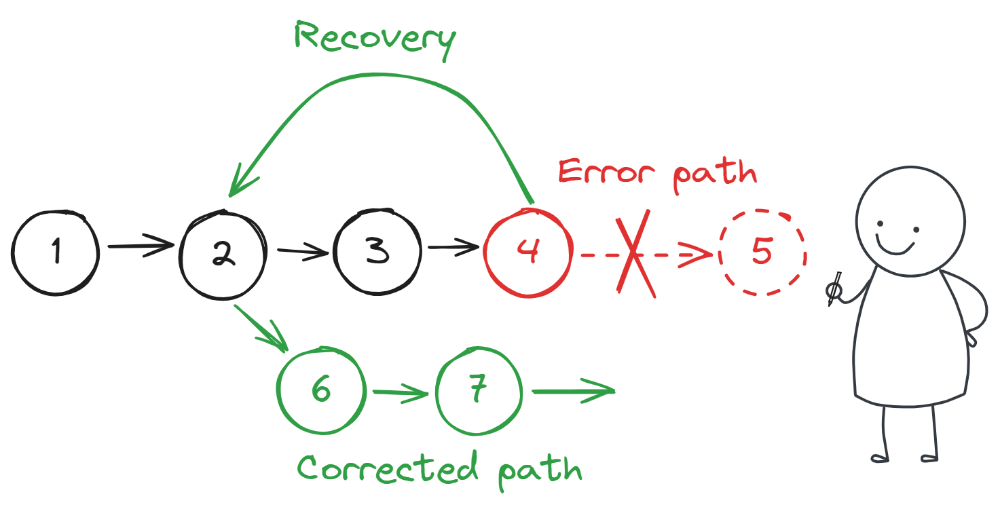
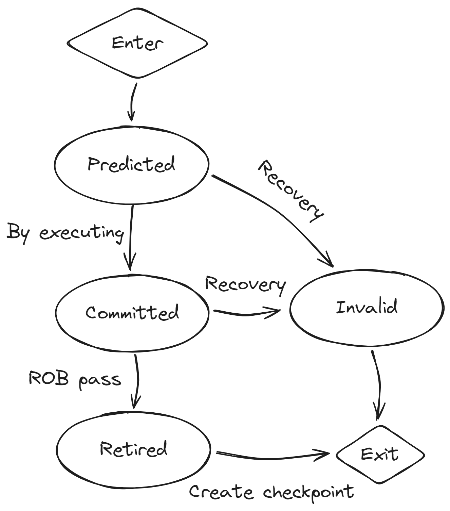

# 分支恢复

分支预测的结果和执行的结果一致是我们所希望的, 但也总有预测失败的情况. 当分支预测失败的时候, 我们需要恢复处理器核心到这条预测失败的分支之前, 该过程称为 **分支恢复** .

对于分支恢复的处理, 同样决定了处理器的性能, 分支恢复的处理决定了分支恢复的时间惩罚(Penalty), 即浪费了多少个周期在错误的路径上, 以及需要多少个周期从错误的路径恢复到正确的路径.



## Bergamot 中的分支恢复

在 Bergamot 存在状态的部件总共有两种:

- 流水线
- 表结构

分支恢复仅对这两种部件进行分支恢复. Bergamot 采用全恢复策略, 即恢复之后, 核心内没有一条有效的指令, 核心等待新路径上的指令重新填充流水线. 有些高性能处理器采用半恢复策略, 即恢复之后核心存在有效的指令继续执行.

当分支恢复进行时, 核心中 `recover` 信号组被拉高, 表示核心进入恢复周期.

### 流水线分支恢复

Bergamot 的一般流水线中的数据存放在 `inReg` 采样寄存器中, 其中有 `valid` 位记录当前数据是否有效.


若流水线检测到 `recover` 信号被拉高, 说明当前处理的数据 `inReg` 都是无效的数据, 需要丢弃, 在一个周期内, 将 `inReg` 中的 `valid` 置 `false` 即可完成恢复.

例如在 ALU 流水线中, 解码阶段的实现:

```scala title="src/main/scala/bergamot/core/execute/ALU.scala"
class ALUDecodeStage extends Module {
  val io = IO(new Bundle {
    // Pipeline interface
    val in = Flipped(DecoupledIO(new ExecuteEntry()))
    val out = DecoupledIO(new ALUExecuteStageEntry())
    // CSR read interface
    val csr = Flipped(new CSRsReadIO())
    // Current core privilege
    val privilege = Input(PrivilegeType())
    // Recovery interface
    val recover = Input(Bool())
  })
  // Pipeline logic
  private val inReg = RegInit(new ExecuteEntry().zero)

  when(io.out.fire) { // Stall
    inReg.valid := false.B
  }
  when(io.in.fire) { // Sample
    inReg := io.in.bits
  }

  io.in.ready := io.out.ready

  // Combinational logic
  // ...
  // ...

  // Recovery logic
  when(io.recover) {
    inReg.valid := false.B
  }
}
```

在最后几行中 `when(io.recover)` 判断 `recover` 信号, `inReg.valid := false.B` 丢弃流水线中的数据.

之后只需要等待正确路径上的数据进入流水线即可.

### 表结构的分支恢复

表结构相对来说比较复杂, 因为其不能单单的只丢弃错误的数据, 还有记录和恢复到原来分支路径上的数据. 对于表结构的分支恢复, 我们首先要介绍指令的生命周期以及指令是如何对核心状态进行修改的.

第一, 一个指令进入核心时, 其状态为 **预测态** , 原因是位于其前面的分支指令的结果可能还未算出, 当前指令可能是处于错误路径上的指令.

第二, 若指令顺利的从四个执行流水线退出之后, 指令的状态为 **已提交** , 此时应该对指令的结果进行数据广播. 然而, 这并不意味着该指令处于正确的路径, 仍有可能处在错误路径.

第三, 若发现当前指令处在错误路径上, 核心立刻从流水线中抹除该指令, 指令的状态为 **失效** .

最后, 若指令顺利的从 ROB 顺序退休之后, 指令的状态为 **已退休** , 此时我们才能断言该指令处于正确的路径, 指令的结果才能影响核心的状态, 核心是一个在程序顺序的中的一个确定的状态, 我们为该状态下的表结构创建 **快照(Snapshot)** 用于以后的分支恢复, 有时也称为 **检查点(Checkpoint)** . 注意 ROB 是按照指令在程序顺序存放指令的, 因此 ROB 中的指令按照程序顺序进行退休, 同样也按照程序顺序修改核心状态.

指令的状态可以用状态图表示为:



接下来, 我们回到表结构的分支恢复, 我们为每一个表, 单独创建一列检查点用于分支恢复, 例如对于寄存器重命名表, 我们为其增加一列 `恢复数据` 作为检查点.

| 寄存器 | 是否等待写回 | 数据凭证 | 已写回数据 | 恢复数据 |
|   -   |      -     |    -    |    -     |    -    |
|   x1  |    false   |    0    |    8     |    0    |
|   x2  |    true    |    2    |    3     |    7    |

假设指令 `x1 = 3 + 5 = 8` 已经的结果广播, 现在将要从 ROB 中退休, 我们要创建到该指令为止的检查点, 将寄存器重命名表中 `x1` 对应的行中 `恢复数据` 字段改为 `8` :

| 寄存器 | 是否等待写回 | 数据凭证 | 已写回数据 | 恢复数据 |
|   -   |      -     |    -    |    -     |    -    |
|   x1  |    false   |    0    |    8     |    8    |
|   x2  |    true    |    2    |    3     |    7    |

假设对新指令 `x1 = 3 + 1` 进行重命名:

| 寄存器 | 是否等待写回 | 数据凭证 | 已写回数据 | 恢复数据 |
|   -   |      -     |    -    |    -     |    -    |
|   x1  |    true    |    1    |    8     |    8    |
|   x2  |    true    |    2    |    3     |    7    |

之后一条分支预测失败的指令使得核心产生分支恢复, 因为分支恢复后核心内再无有效指令, 因此将所有的 `是否等待写回` 列的值写为 `false` , 用 `恢复数据` 覆写 `已写回数据` :

| 寄存器 | 是否等待写回 | 数据凭证 | 已写回数据 | 恢复数据 |
|   -   |      -     |    -    |    -     |    -    |
|   x1  |    false   |    x    |    8     |    8    |
|   x2  |    false   |    x    |    7     |    7    |

此时寄存器重命名表将恢复到上一个检查点的状态.