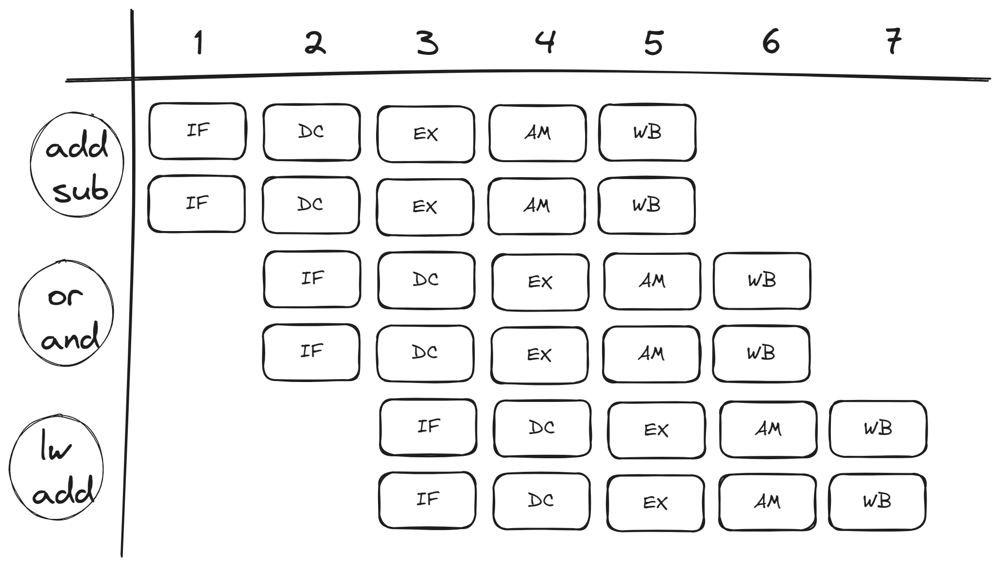
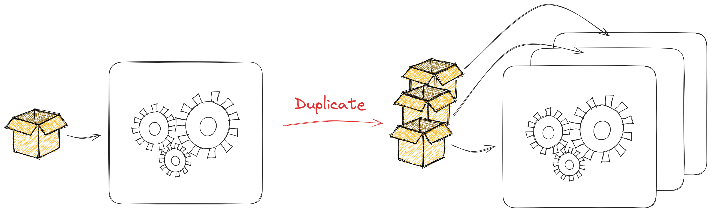
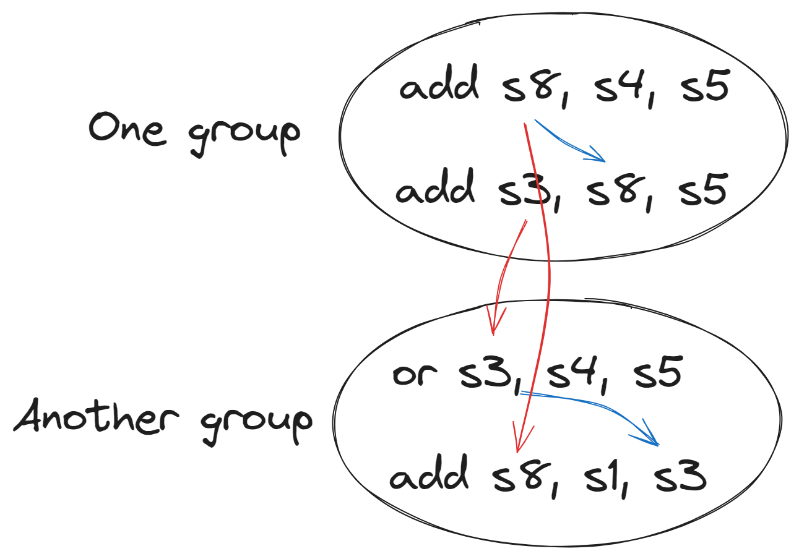

# 什么是超标量

超标量处理器的定义为 **在一个周期可以执行并完成多条指令的处理器, 即指令的最大吞吐量大于 1 指令/周期.**

:::danger 区别简单多周期处理器和超标量处理器

简单多周期处理器虽然能在一个周期同时执行多条指令, 但无法在一个周期完成多条指令, 完成一条指令是指从处理器中完成其功能并修改了核心的状态并从处理器中退出, 术语称为指令退休 (Retire).

简单多周期处理器的 IPC(指令数每周期) 一定小于等于 1, 而超标量处理器的 IPC 一定大于等于 2.

:::

下图展示了一种可能的 2-way 超标量处理器在执行一段指令的过程:



在 2-way 超标量处理器中, 一个最大的特点就是每 2 个紧邻的指令成组的执行.

为了实现超标量结构, 一些部件, 必须要求能够同时处理两个或两个以上的指令. 例如, 之前的一个单端口寄存器, 为了能够同时处理两条指令, 必须使用一个双端口寄存器.



## 指令间依赖

但是, 这并不是实现超标量结构的难点所在, 而是如何处理被打包的指令间依赖, 例如在 2-way 超标量处理器中, 如何处理组内 2 条指令之间的依赖.

当然, 若两条指令没有依赖互相独立, 两条指令可以同时进入, 同时退休, 对于这种情况是再好不过的, 此时的 IPC 也可以达到最大理想 IPC.

若两条指令有依赖, 我们必须通过某种检测机制检测出来, 假设 B 依赖于 A, 那么 A 指令需要先执行, B 指令就需要后执行, 我们可能需要添加必要的 Stall 周期来消除这种指令间依赖性.

结论是, 如何设计超标量部件以及高效的处理指令间依赖是我们设计超标量处理器的重点所在.



## Bergamot 中的超标量

Bergamot 是一种 2-way 超标量架构, 在 Bergamot 超标量设计中, 我们同样采用指令打包的方式, 在对于每一个超标量部件, 其输入的信号都包括两条指令的同时输入.

例如, 在指令译码阶段:

```scala title="src/main/scala/bergamot/core/decode/Decode.scala"
val io = IO(new Bundle {
    // Pipeline interface
    val in = Flipped(DecoupledIO(Vec2(new DecodeStageEntry())))
    val out = DecoupledIO(Vec2(new RegisterMappingStageEntry()))
    // Recovery interface
    val recover = Input(Bool())
})
```

其中 `val in = Flipped(DecoupledIO(Vec2(new DecodeStageEntry())))` 表示两条指令同时输入. 在译码阶段, 两条指令的译码过程是相互独立的, 因此在原有单指令的译码基础上, 我们只需要对两条指令同时译码即可.

```scala title="src/main/scala/bergamot/core/decode/Decode.scala"
inReg.zip(io.out.bits).foreach { case (in, out) =>
    // Decode...
}
```

利用 Scala 的 `foreach` 我们可以直接通过单条指令译码生成并行双译码电路.

`in` 表示其中一条指令的输入, `out` 表示其中一条指令的输出.

最后, 模块端口输出部分同样需要两条指令的译码结果并行输出 `val out = DecoupledIO(Vec2(new RegisterMappingStageEntry()))`.